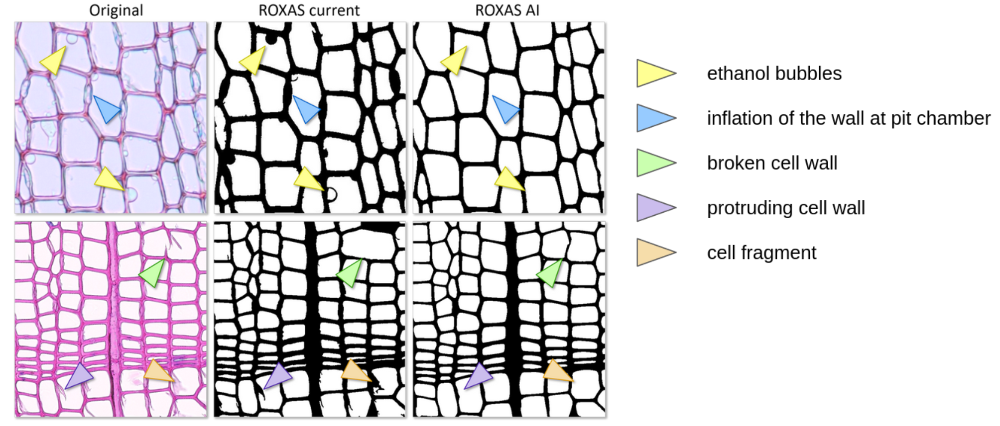

# Towards ROXAS AI: Deep learning for faster and more accurate conifer cell analysis

by 
Marc Katzenmaier,
Vivien Sainte Fare Garnot,
Jesper Björklund,
Loïc Schneider,
Jan Dirk Wegner,
Georg von Arx

[[Paper](https://www.sciencedirect.com/science/article/pii/S1125786523000760?via%3Dihub)] 
[[Dataset](https://zenodo.org/records/8369376)]
[[BibTex](#Cite)]

## Exemplary impovement over ROXAS


## Install
create a python environment and run the following command to install all requirements
```
pip install torch torchvision opencv-python numpy pytorch-lightning segmentation-models-pytorch scikit-image glob2 
```

## Usage
Download the model from [here](https://drive.google.com/file/d/1_U9YAKFDTgyjLzkLygomZDaGYlzNHIBn/view?usp=sharing) and run the model with
```
python run_model.py --input=./input/001.jpg --output=./output/001.png
```
This code will save the output in a .png file. The png files are for visual inspection. If the model is not in the TowardsRoxasAI folder specify the path with `--model=path_to_model`

Note: This script will run the model only on the CPU which is significantly slower than on the GPU. This is done to make it as accessible as possible for everyone to try out if the model will work on his data.

## Dataset
The dataset can be downloaded form [Zenodo](https://zenodo.org/records/8369376)

## Contributors
We thank A. Ivanova, A. Arzac, A. Piermattei, A.L. Prendin, A. Kaiser, A. Louy, D. Castagneri, D. Benito, D. Noordermeer, G. Petit, G. Giberti, H. Song, I. Serra Olabuenaga, K. Janecka, K. Seftigen, L. Petrucco, L. Mateju, L. Haberbauer, M. Ferriz Nunez, M. Guerin, M. Klisz, M. Carrer, M. Tabakova, M. Fonti, M. Vos, M. Dell'Oro, M. Rydval, N. Maredova, P. Fonti, R. aus der Au, R. Peters, V. Shishov, T. Pampuch and V. Simanko for providing training images for the deep learning models.

## Cite
If you use Towards Roxas AI in your research, please use the following BibTeX entry.
```
@article{KATZENMAIER2023126126,
    title = {Towards ROXAS AI: Deep learning for faster and more accurate conifer cell analysis},
    author = {Marc Katzenmaier and Vivien Sainte Fare Garnot and Jesper Björklund and Loïc Schneider and Jan Dirk Wegner and Georg {von Arx}}
    journal = {Dendrochronologia},
    year = {2023},
    doi = {https://doi.org/10.1016/j.dendro.2023.126126},
}
```